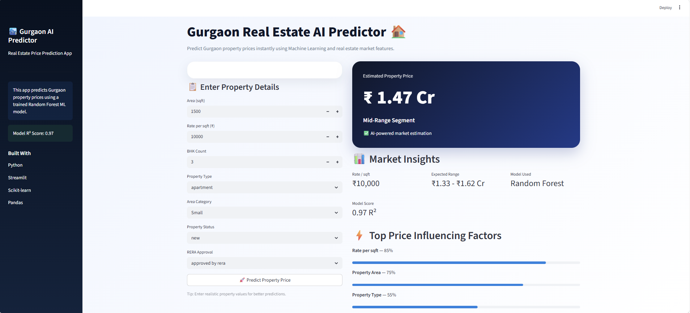

# 🏙️ Gurgaon Real Estate Market Analysis & Price Prediction

An end-to-end Data Analytics and Machine Learning project focused on Gurgaon real estate properties.  
This project performs data cleaning, exploratory data analysis (EDA), visualization, feature engineering, and property price prediction using Random Forest Regression.

---

# 📌 Project Overview

This project analyzes Gurgaon real estate property data to discover pricing trends and build a machine learning model capable of predicting property prices based on property features.

The project includes:

- Data Cleaning
- Exploratory Data Analysis
- Data Visualization
- Feature Engineering
- Machine Learning Models
- Streamlit Web App
- Property Price Prediction

---


# 📷 App Preview



# 🚀 Technologies Used

- Python
- Pandas
- NumPy
- Matplotlib
- Seaborn
- Scikit-learn
- Streamlit
- Joblib

---

# 📂 Project Structure

```bash
Gurgaon-Real-Estate-Analysis/
│
├── app.py
├── gurgaon_price_model.pkl
├── requirements.txt
├── README.md
│
├── data/
│   └── data_of_gurugram_real_estate.csv
│
├── images/
│   └── app_screenshot.png
│
└── notebooks/
    └── gurgaon_real_estate_analysis.ipynb
```

---

# 📊 Key Analysis Performed

## ✔ Data Cleaning
- Missing value handling
- Duplicate checking
- Category standardization
- Outlier detection

## ✔ Exploratory Data Analysis
- Price distribution analysis
- Area vs Price analysis
- BHK analysis
- Locality-wise pricing
- Property type comparison
- RERA approval analysis

## ✔ Feature Engineering
- Price segmentation
- Area categorization
- One-hot encoding
- Feature selection

## ✔ Machine Learning
### Models Used:
- Linear Regression
- Random Forest Regressor

### Model Performance:
| Model | R² Score |
|---|---|
| Linear Regression | 0.53 |
| Random Forest | 0.97 |

---

# 📈 Important Insights

- Rate per sqft and area are the strongest factors affecting property prices.
- Luxury and ultra-luxury properties dominate premium sectors.
- Random Forest significantly outperformed Linear Regression.
- Property pricing in Gurgaon shows strong non-linear behavior.

---

# 🧠 Machine Learning Workflow

```python
Data Cleaning
→ EDA
→ Feature Engineering
→ Encoding
→ Train-Test Split
→ Model Training
→ Prediction
→ Evaluation
→ Deployment
```

---

# 💻 Streamlit Web App

The project includes an interactive Streamlit application for predicting Gurgaon property prices.

## Features:
- Interactive UI
- Real-time prediction
- Property feature selection
- ML-based price estimation

---

# ▶️ Run Locally

## 1️⃣ Install Dependencies

```bash
pip install -r requirements.txt
```

## 2️⃣ Run Streamlit App

```bash
python -m streamlit run app.py
```

---

# 🎯 Future Improvements

- Add locality-based prediction
- Deploy on Streamlit Cloud
- Add advanced ML models (XGBoost)
- Add Power BI dashboard integration
- Add real-time market trends

---

# 👨‍💻 Author

Nitin Raj

BTech CSE | Data Analytics & Machine Learning Enthusiast

